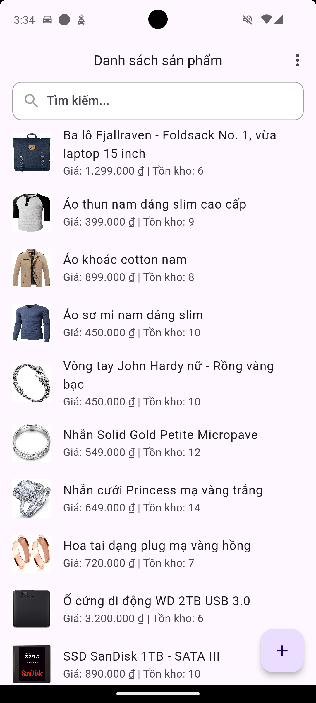
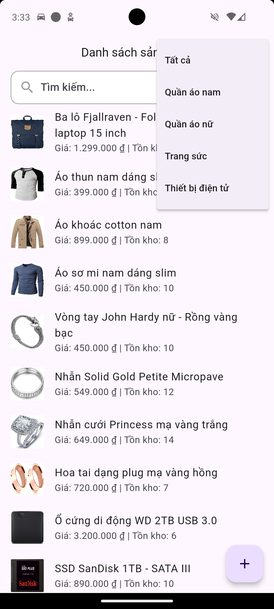
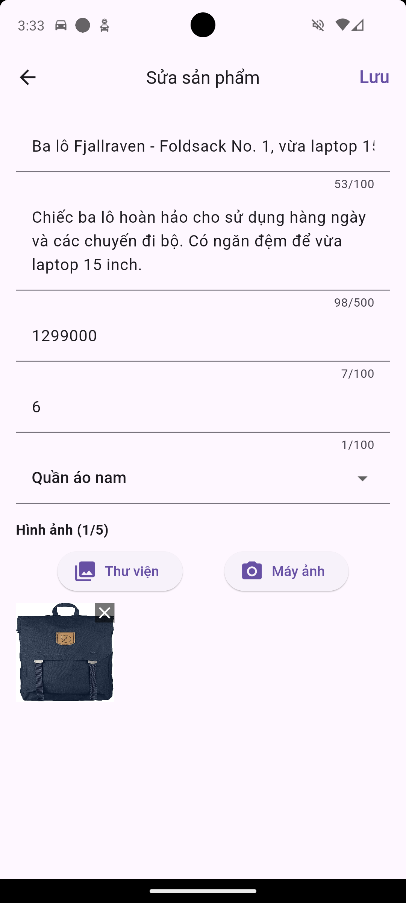

# Flutter Product Manager Demo

Ứng dụng quản lý sản phẩm được xây dựng bằng Flutter. Ứng dụng này cho phép người dùng xem, tìm kiếm, thêm, cập nhật và xóa thông tin sản phẩm.

---

## 🗂️ Cấu trúc dự án

```
lib/
├── config/              # Cấu hình mock data
├── core/                # Các tiện ích cốt lõi và dịch vụ (ví dụ: database, dialog, helper)
├── data/                # Repository, data source (remote và local), model
├── domain/              # UseCase và các interface của repository
├── presentation/        # Giao diện người dùng: màn hình, widget, Bloc
├── main.dart            # Điểm khởi chạy ứng dụng
├── service_locator.dart # Cấu hình GetIt để quản lý phụ thuộc (Dependency Injection)
```

## 🎨 UI

<p float="left">
  
  
  
  
</p>

## 🚀 Công nghệ & các thư viện chính

### 🧰 State Management
- **flutter_bloc**: `^9.1.1` – Quản lý trạng thái ứng dụng, sử dụng BLoC pattern để xử lý các sự kiện và trạng thái của danh sách sản phẩm, danh mục và chi tiết sản phẩm.
- **equatable**: `^2.0.7` – So sánh giá trị trong các state/event.

### 🧱 Dependency Injection
- **get_it**: `^8.0.3` – Dependency Injection để quản lý các phụ thuộc như BLoC, UseCase, Repository, và DataSource.

### 🌐 Networking
- **http**: `^1.4.0` – API requests
- **connectivity_plus**: `^6.1.4` – Kiểm tra trạng thái kết nối mạng (dù hiện tại dùng dữ liệu tĩnh).

### 💾 Local Storage
- **sqflite**: `^2.4.1` – Lưu trữ dữ liệu cục bộ trong cơ sở dữ liệu SQLite, sử dụng DatabaseService để quản lý sản phẩm và danh mục.
- **path**: `^1.9.0` – Xử lý đường dẫn tệp tin, hỗ trợ lưu trữ hình ảnh và cơ sở dữ liệu.

### 📸 Image Handling
- **image_picker**: `^1.1.2` – Cho phép người dùng chọn hình ảnh từ thư viện hoặc chụp ảnh từ máy ảnh để thêm vào sản phẩm.
- **cached_network_image**: `^3.4.1` –  Tải và hiển thị hình ảnh từ URL, với bộ nhớ đệm để tối ưu hiệu suất.

### 🧭 Navigation
- **go_router**: `^15.1.2` – Điều hướng giữa các màn hình

### 📦 UI Helpers
- **carousel_slider**: `^5.1.1` – Hiển thị hình ảnh sản phẩm dạng carousel.
- **intl**: `^0.20.2` – Định dạng số tiền (VD: giá sản phẩm) theo định dạng tiền tệ Việt Nam (VND).
- **collection**: `^1.18.0` – Cung cấp các tiện ích xử lý tập hợp dữ liệu.
---

## 📱 Cách chạy ứng dụng

## 1. Clone repository:

Đảm bảo bạn đã cài đặt Flutter:
```bash
git clone https://github.com/truongphat411/flutter_product_manager_demo.git
```

## 2. Cài đặt dependencies: 
Chạy lệnh sau để tải các thư viện:
```bash
flutter pub get
```

## 3. Run App on Android or iOS:
Để chạy trên Android:
```bash
flutter run
```
Để chạy trên IOS:
```bash
open ios/Runner.xcworkspace
# Sau đó chạy từ Xcode hoặc:
flutter run
```
Lưu ý: Bạn có thể cần chạy flutter doctor để kiểm tra các vấn đề về môi trường (Xcode, Android SDK, ...)

## 🧪 Mock API
Ứng dụng sử dụng dữ liệu giả lập (mock data) để mô phỏng tương tác với API backend.

```
lib/
└── config/
    └── mock_data/
        └── mock_category_data.dart
        └── mock_data.dart
        └── mock_product_data.dart
```

📦 Dữ liệu có sẵn bao gồm:
- MockCategoryData: Danh sách danh mục sản phẩm mẫu
- MockProductData: Danh sách sản phẩm mẫu thuộc nhiều danh mục

🧰 Các phương thức hỗ trợ trong mock:
| Phương thức               | Mô tả                                |
| ---------------------- | ---------------------------------------- |
| getAll()                    | Lấy toàn bộ danh mục hoặc sản phẩm     |
| getById(int id)                              | 	Trả về chi tiết sản phẩm theo id |
| add(ProductModel product)                    | Thêm sản phẩm mới        |
| update(ProductModel updated)                 | 	Cập nhật sản phẩm theo id        |
| delete(int id)        | Xoá sản phẩm theo id |
| addImage(int productId, String url)	       | Thêm ảnh mới cho sản phẩm           |
